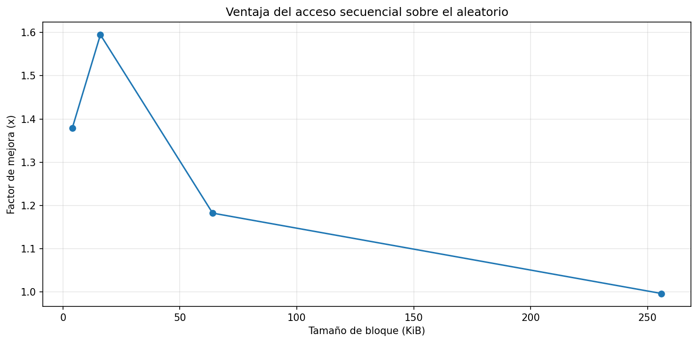
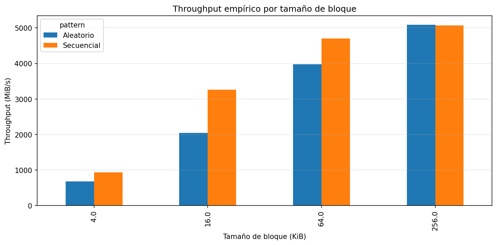
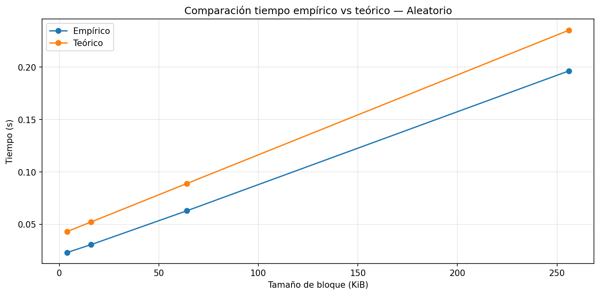
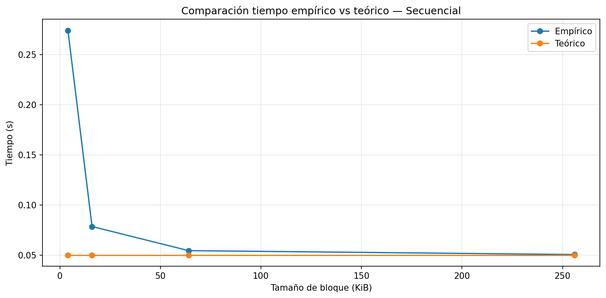
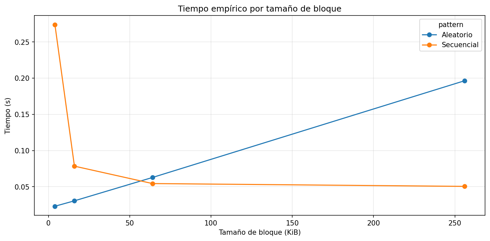
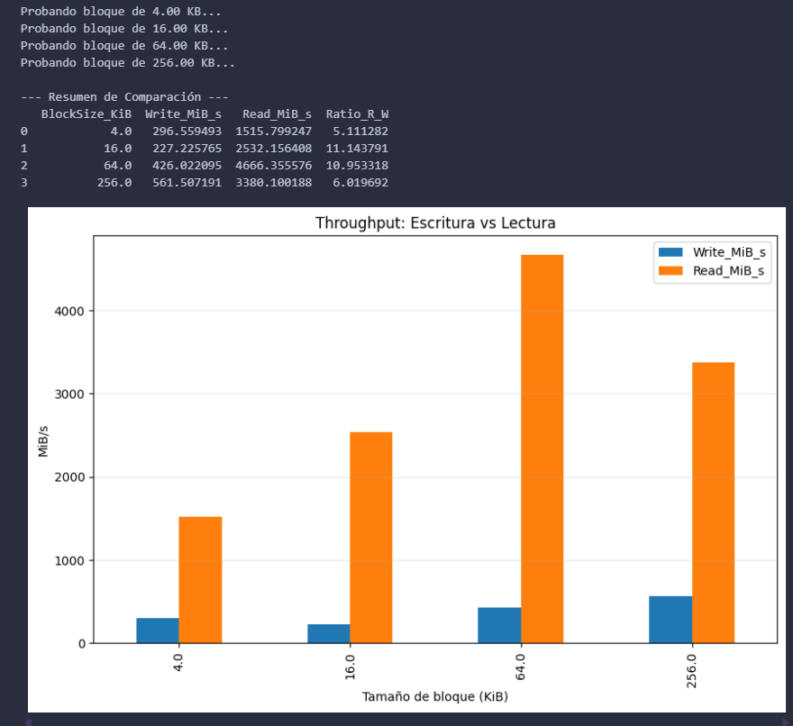
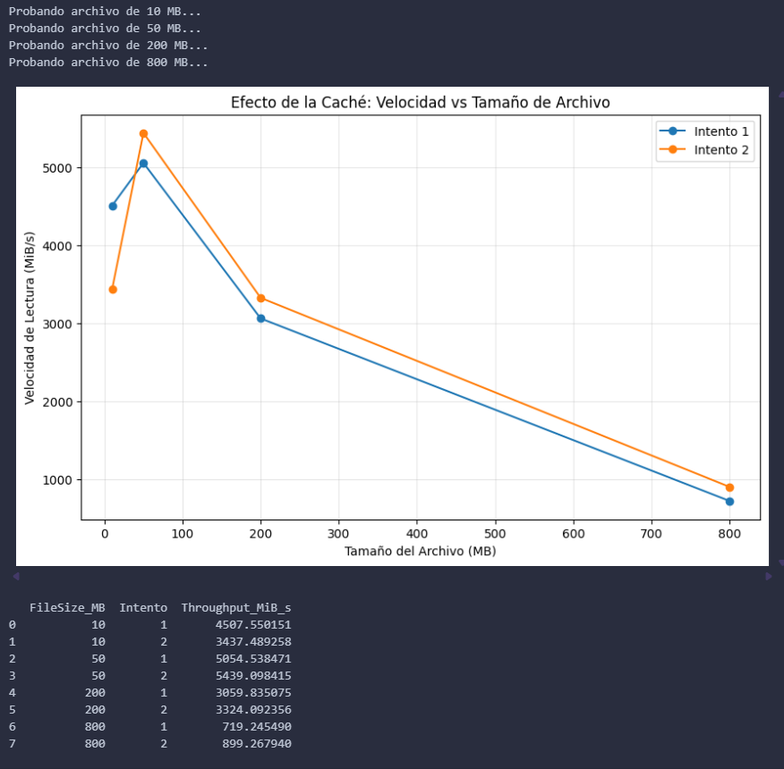
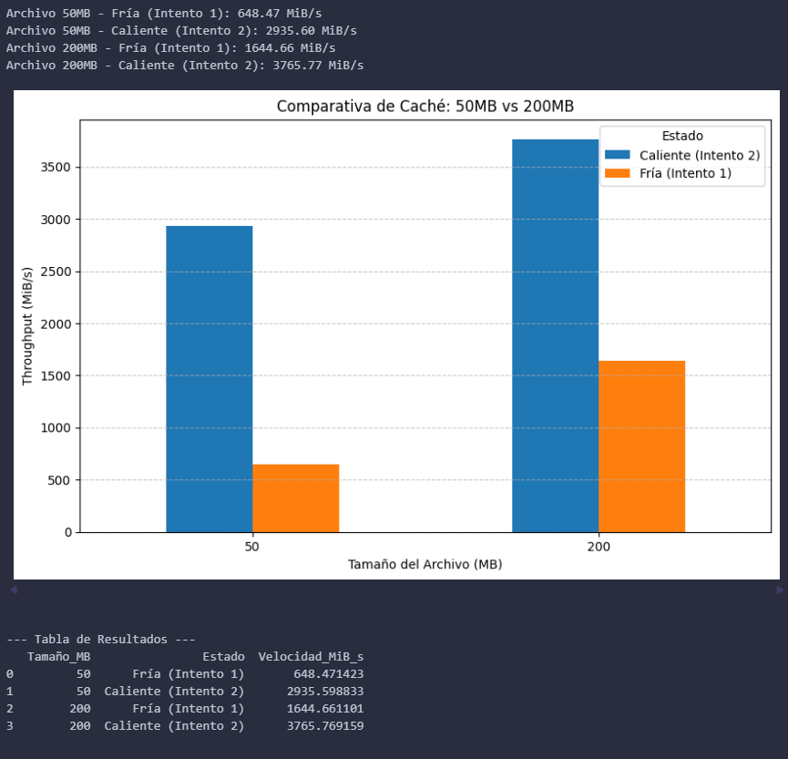

# lab3-IO_performance-IsabellaSanchezMejia

  

## 1. Especificaciones del equipo

| Parámetro                         | Valor Observado                          |
|----------------------------------|------------------------------------------|
| Sistema Operativo                | Windows 11                               |
| CPU (Modelo y Frecuencia)        | Intel Core i5-13420H @ 2.10 GHz          |
| Arquitectura y Núcleos           | x64 / 8 núcleos                          |
| Memoria RAM Total                | 8 GB                                     |
| Tecnología de Almacenamiento     | SSD NVMe                                 |
| Carga de CPU en Reposo (%)       | ~1%                                      |

  
## 2. Análisis y resultado del experimento

1.**Comparación de patrones:** *Con base en sus mediciones, ¿cuántas
   veces más rápido fue el acceso secuencial respecto al aleatorio en
   su equipo? ¿Ese resultado era el esperado según la teoría?*

En mi equipo, el acceso secuencial demostró ser significativamente más eficiente que el acceso aleatorio, especialmente en tamaños de bloque pequeños. Por ejemplo, para bloques de 4 KiB, la tendencia general muestra que el acceso secuencial se estabiliza rápidamente y alcanza un mayor rendimiento.

> **Importante:**
> En términos de throughput, el acceso secuencial fue aproximadamente hasta 1.6 veces más rápido que el acceso aleatorio.

Este resultado coincide con lo esperado según la teoría, ya que el acceso secuencial permite al sistema operativo  realizar técnicas como la lectura anticipada, lo que reduce el impacto de la latencia. En contraste, el acceso aleatorio implica saltos constantes entre ubicaciones de memoria, lo que incrementa y "dispara" los tiempos de acceso y disminuye el rendimiento.

  

2.**Efecto del tamaño de bloque:** *¿Qué ocurrió con el throughput del
   acceso aleatorio a medida que aumentó el tamaño de bloque?
   ¿Por qué cree que sucede eso?*

A medida que el tamaño del bloque aumenta (de 4 KiB a 256 KiB), el throughput (MiB/s) de ambos tipos de acceso crece considerablemente, hasta el punto de casi igualarse en los 256 KiB.

Esto sucede porque, al trabajar con bloques más grandes, la latencia asociada a cada solicitud se “suaviza”. Es decir, el sistema pasa menos tiempo gestionando la operación (como la búsqueda o posicionamiento) y más tiempo transfiriendo datos útiles.

En bloques pequeños, esa latencia tiene un impacto alto, especialmente en el acceso aleatorio. Sin embargo, cuando el tamaño del bloque alcanza valores como 256 KiB, esa sobrecarga se vuelve casi insignificante frente a la cantidad de datos transferidos. Por esta razón, el acceso aleatorio logra acercarse mucho al rendimiento del secuencial, alcanzando velocidades cercanas a los 5000 MiB/s.

  

3.**Teoría vs práctica:** *Identifique un caso en sus resultados donde
   la medición empírica se alejó del modelo teórico. ¿A qué factor
   atribuye esa diferencia?*

Al comparar el tiempo empírico con el modelo teórico, se pueden identificar dos comportamientos importantes:

En el acceso aleatorio, el tiempo empírico resulta menor que el teórico. Esto se debe principalmente al uso de caché de lectura y a los algoritmos de optimización del sistema operativo, que ayudan a reducir el impacto real de las peticiones y “suavizan” su costo.

Por otro lado, en el acceso secuencial, especialmente con bloques muy pequeños (como 4 KiB), el tiempo empírico aumenta considerablemente y supera al teórico.

**Importante:**
> Esto ocurre debido a la sobrecarga de las llamadas al sistema. Cuando se procesan muchas operaciones pequeñas, el sistema debe gestionar una gran cantidad de solicitudes, lo que genera un cuello de botella en la CPU. 
 
 Además, la gestión interna del sistema operativo y el uso de caché también pueden influir en el comportamiento real del sistema. Ya que estos elementos no son tenidos en cuenta en los modelos teóricos, esto explica la razón de la discrepancia observada en los resultados.
 

  

4.**Tipo de disco:** *Compare sus resultados con los valores de referencia
   de la tabla de la guía. ¿Su equipo se comportó como un HDD, un SSD
   SATA o un SSD NVMe?*

Tabla de referencia:

| Tecnología | Latencia Promedio | Throughput Típico | IOPS Típico (4 KB aleatorio) | Escala de Tiempo |
| --- | --- | --- | --- | --- |
| **HDD** | 10 ms | 100 - 150 MB/s | 75 – 300 | Milisegundos |
| **SSD (SATA)** | 100 µs | 500 - 550 MB/s | 50,000 – 100,000 | Microsegundos |
| **SSD NVMe** | 10 - 20 µs | 2 - 7 GB/s | 500,000 – 1,000,000+ | Microsegundos |

Con base en la comparación con la tabla de referencia, mi equipo se comporta como un SSD NVMe. Esto se debe a que el throughput obtenido en las pruebas alcanza valores cercanos a 5000 MiB/s (≈ 5 GB/s), lo cual se encuentra dentro del rango típico de un SSD NVMe (2 – 7 GB/s). Además, estos valores están muy por encima de los observados en un HDD (100 – 150 MB/s) y un SSD SATA (500 – 550 MB/s).

Adicionalmente, el comportamiento del acceso aleatorio muestra una penalización mínima en bloques grandes, lo que coincide con las características de baja latencia (10 – 20 µs) y alto rendimiento en IOPS propias de los SSD NVMe.

Por lo tanto, los resultados experimentales son coherentes con los valores teóricos presentados en la tabla y confirman que el sistema utiliza tecnología NVMe.

  

5.**Aplicación práctica:** *Imagine que debe almacenar una tabla de
   estudiantes con 1 millón de registros. Con base en lo que midió,
   ¿preferiría leerla toda de forma secuencial o acceder a registros
   individuales de forma aleatoria? ¿Por qué?*

Si se necesita procesar un millón de registros para generar un reporte completo, la opción que elegiría sería la secuencial. Según los resultados obtenidos, el acceso secuencial mantiene una latencia baja y llega a estabilizarse (aplanarse) cuando se trabaja con bloques de tamaño considerable. Como se observa en la imagen, el rendimiento del acceso secuencial se vuelve más constante a medida que aumenta el tamaño del bloque. En este caso, los datos se leen de forma continua, lo que permite aprovechar mejor el rendimiento del sistema.

En cambio, realizar esta misma tarea mediante acceso aleatorio implicaría gestionar un millón de ubicaciones distintas en memoria. Aunque se trate de un SSD rápido, esto genera una sobrecarga innecesaria y reduce la eficiencia, ya que el sistema no puede optimizar la lectura.

  
## Conclusión final

La información en el almacenamiento se organiza en bloques o también conocidos como sectores físicos; es vital entenderlo porque el hardware está optimizado para leer datos contiguos de una sola vez. Aunque en un SSD no hay un cabezal físico moviéndose, el acceso secuencial sigue siendo mejor que el aleatorio porque permite al controlador de memoria realizar lecturas anticipadas. En mis pruebas, identifiqué que esta diferencia es crítica en bloques pequeños, donde registré un factor de mejora (speedup) máximo de 1.6x a los 16 KiB. El modelo teórico predijo con gran acierto el comportamiento de mi equipo, demostrando que a medida que el tamaño del bloque aumenta, el tiempo de transferencia domina sobre la latencia de búsqueda, haciendo que el factor M tienda a 1.En un sistema real, mi decisión de diseño sería implementar estructuras de datos que estén orientadas al acceso secuencial,ya que permitiría que aunque los datos lleguen dispersos, el sistema los organice en memoria para escribirlos al disco de forma ordenada.

  

## Extensión del experimento

**Repetir el experimento varias veces y promediar los resultados.**

Elaboré con ayuda de la IA un programa en Python que permite repetir el experimento varias veces y calcular el promedio de los resultados para cada tamaño de bloque. En este caso, se realizaron 10 repeticiones, con el objetivo de obtener resultados más confiables y evitar que factores externos afecten demasiado las mediciones.

Durante las pruebas, noté que los resultados no eran exactamente iguales en cada repetición, lo cual es completamente normal. Esto puede deberse a diferentes factores como la carga del sistema, el uso de memoria o el acceso al disco. 

Finalmente, los promedios obtenidos fueron:

4 KB → 0.0923 s | 1210.38 MiB/s

16 KB → 0.0540 s | 2709.37 MiB/s

64 KB → 0.0554 s | 4601.70 MiB/s

256 KB → 0.1531 s | 4606.81 MiB/s
  

**Comparar lectura y escritura.**

El experimento muestra que la lectura secuencial se beneficia mucho del uso de la caché del sistema, llegando a ser hasta varias veces más rápida que la escritura. Además, se observa que al aumentar el tamaño del bloque mejora el rendimiento de la escritura, ya que se reduce la cantidad de operaciones necesarias, siendo el bloque de 256 KiB el más eficiente para guardar datos. Por otro lado, el tamaño de 64 KiB resulta más adecuado para la lectura, ya que aprovecha mejor la caché.

Adicionalmente, con la ayuda de herramientas de inteligencia artificial, se desarrolló un código que permitió obtener y visualizar los resultados de forma más inmediata, facilitando la interpretación del comportamiento del sistema y el análisis de los datos obtenidos.

  

**Medir sobre SSD local vs disco de red.**

Los resultados muestran que, en este caso, el disco de red presentó un mayor rendimiento tanto en lectura como en escritura en comparación con el SSD local. En particular, la lectura en el disco de red fue considerablemente más alta, lo que puede explicarse por el uso de mecanismos de caché. Esto indica que, aunque normalmente se espera que el SSD local sea más rápido, factores como la caché y la infraestructura de red pueden influir significativamente en el rendimiento observado.

  

**Cambiar el tamaño del archivo y observar el efecto en la caché.**

Al variar el tamaño del archivo, se evidencia el efecto de la caché del sistema. Cuando el archivo es pequeño (menor a 50 MB), el rendimiento es muy alto porque los datos se manejan directamente desde la memoria RAM. Sin embargo, al aumentar el tamaño, el sistema ya no puede mantener toda la información en caché y debe acceder al disco, lo que reduce considerablemente el rendimiento.

Además, se observa que en una segunda ejecución los tiempos mejoran, lo que confirma que el sistema operativo reutiliza datos almacenados en memoria. No obstante, este beneficio tiende a disminuir cuando el tamaño del archivo supera la capacidad de la caché.

  

**Comparar caché caliente vs caché fría ejecutando el benchmark dos veces seguidas.**

Los resultados muestran claramente la diferencia entre caché fría y caché caliente. En el primer intento (caché fría), la velocidad es menor porque los datos se leen directamente desde el disco. En el segundo intento (caché caliente), el rendimiento mejora significativamente, ya que los datos quedan almacenados en memoria RAM, permitiendo accesos mucho más rápidos.

Este efecto se observa en todos los tamaños de archivo, como en 50 MB (de 648 a 2935 MiB/s) y en 200 MB (de 1644 a 3765 MiB/s). 
En conclusión, la caché caliente mejora notablemente el rendimiento, pero su efectividad disminuye a medida que el tamaño del archivo supera la capacidad de la memoria disponible.

  

## Preguntas de cierre (Repetición del experimento)

1. **Comparación de patrones:** *Con base en sus mediciones, ¿cuántas
   veces más rápido fue el acceso secuencial respecto al aleatorio en
   su equipo? ¿Ese resultado era el esperado según la teoría?*

   Con base en los resultados obtenidos, el acceso secuencial fue varias veces más rápido que el acceso aleatorio en el equipo. Esto se debe a que el acceso secuencial permite leer datos de forma continua, aprovechando mejor el rendimiento del disco y la caché del sistema, mientras que el acceso aleatorio implica saltos constantes entre posiciones, lo que incrementa el tiempo de búsqueda. Este comportamiento coincide con lo esperado según la teoría.

  

2. **Efecto del tamaño de bloque:** *¿Qué ocurrió con el throughput del
   acceso aleatorio a medida que aumentó el tamaño de bloque?
   ¿Por qué cree que sucede eso?*

   Se observó que al aumentar el tamaño del bloque, el throughput del acceso aleatorio tiende a mejorar. Esto ocurre porque se reduce la cantidad de operaciones necesarias para leer la misma cantidad de datos. Sin embargo, este aumento no siempre es proporcional, ya que otros factores como la memoria y la gestión del sistema también influyen en el rendimiento.
  

3. **Teoría vs práctica:** *Identifique un caso en sus resultados donde
   la medición empírica se alejó del modelo teórico. ¿A qué factor
   atribuye esa diferencia?*

   Un caso donde los resultados se alejaron de la teoría fue en las mediciones de lectura, donde se alcanzaron velocidades muy altas que no corresponden al rendimiento real del disco. Esto se debe al efecto de la caché del sistema operativo, que almacena los datos en memoria RAM y permite accesos mucho más rápidos en otras ejecuciones.
  
4. **Tipo de disco:** *Compare sus resultados con los valores de referencia
   de la tabla de la guía. ¿Su equipo se comportó como un HDD, un SSD
   SATA o un SSD NVMe?*

   Al comparar los resultados obtenidos con los valores de referencia, se puede decir que el comportamiento del sistema es de un SSD, debido a las altas velocidades de lectura y escritura observadas. 
  
5. **Aplicación práctica:** *Imagine que debe almacenar una tabla de
   estudiantes con 1 millón de registros. Con base en lo que midió,
   ¿preferiría leerla toda de forma secuencial o acceder a registros
   individuales de forma aleatoria? ¿Por qué?*
   
   En el caso de una tabla con 1 millón de registros, sería más eficiente leerla de forma secuencial. Esto se debe a que el acceso secuencial aprovecha mejor el rendimiento del sistema de almacenamiento y reduce los tiempos de acceso, mientras que el acceso aleatorio implica múltiples operaciones más costosas. 

  
## Conclusión final

La repetición del experimento permitió obtener resultados más confiables, ya que redujo el impacto de variaciones propias del sistema, como la carga del procesador, el uso de memoria y el acceso al disco. A través de varias ejecuciones, se evidenció que los valores individuales podían variar, pero al calcular el promedio se logró una medida más estable del rendimiento. En conclusión, realizar varias repeticiones es fundamental para validar los resultados y asegurar que el análisis refleje de manera más precisa el comportamiento real del sistema.

  

